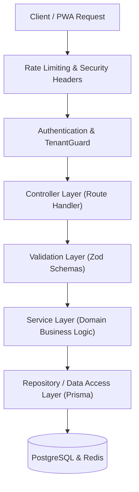

# API Architecture & Specifications: Library Management SaaS

## 1. Architectural Style & Layering
The backend API is implemented in Node.js (Express or Fastify) following strict separation of concerns:



### Layer Rules:
1. **Controllers**: Parse input, call services, format JSON response. Zero business or SQL logic.
2. **Validation**: All inputs (`body`, `params`, `query`) strictly validated via Zod schemas. Invalid payloads rejected with standardized `422 Unprocessable Entity` or `400 Bad Request`.
3. **Services**: Encapsulate all domain rules, cross-table transactions, audit log creation, and asynchronous event dispatches.
4. **Data Access**: Prisma Client queries restricted with explicit `select` fields to prevent leaks.

---

## 2. Standardized Response Formats

### 2.1 Success Response Envelope
```json
{
  "success": true,
  "data": {},
  "meta": {
    "page": 1,
    "limit": 20,
    "total": 142,
    "totalPages": 8
  }
}
```

### 2.2 Error Response Envelope
```json
{
  "success": false,
  "error": {
    "code": "TENANT_ACCESS_DENIED",
    "message": "You do not have permission to access this library.",
    "details": []
  }
}
```

---

## 3. Core API Endpoints

### 3.1 Authentication & Profile (`/api/v1/auth`)
* `POST /api/v1/auth/otp/request`: Request 6-digit email OTP (Rate-limited).
* `POST /api/v1/auth/otp/verify`: Verify OTP, returns JWT tokens + user profile.
* `POST /api/v1/auth/google`: Verify Google OAuth token.
* `POST /api/v1/auth/refresh`: Rotate refresh token, issue new access token.
* `POST /api/v1/auth/logout`: Invalidate session and refresh token.
* `GET /api/v1/auth/me`: Current user context and accessible libraries.

### 3.2 Library Management (`/api/v1/libraries`)
* `POST /api/v1/libraries`: Create new library (owner assigned).
* `GET /api/v1/libraries`: List libraries accessible to current user.
* `GET /api/v1/libraries/:libraryId`: Fetch library metadata & settings.
* `PUT /api/v1/libraries/:libraryId`: Update library details.
* `GET /api/v1/libraries/:libraryId/dashboard`: Real-time dashboard metrics (active students, seats, expiring memberships).

### 3.3 Physical Spaces (`/api/v1/libraries/:libraryId/spaces`)
* `GET /rooms` | `POST /rooms` | `PUT /rooms/:roomId` | `DELETE /rooms/:roomId`
* `GET /rooms/:roomId/rows` | `POST /rows` | `PUT /rows/:rowId`
* `POST /rows/:rowId/seats/batch-generate`: Rapid generator (e.g., prefix "A-", count 20).
* `GET /seats` (filters: `roomId`, `rowId`, `status`)
* `PUT /seats/:seatId`: Update status (`AVAILABLE`, `MAINTENANCE`, `RESERVED`).

### 3.4 Students & KYC (`/api/v1/libraries/:libraryId/students`)
* `GET /`: Searchable, paginated student list (phone, name, status, seat).
* `POST /`: Multi-step student registration (profile, KYC ref, initial membership).
* `GET /:studentId`: Student full profile, membership timeline, seat assignment.
* `PUT /:studentId`: Update profile.
* `DELETE /:studentId`: Soft delete/archive student.
* `GET /:studentId/kyc-document`: Ephemeral signed URL to view Aadhaar document.

### 3.5 Memberships & Pauses (`/api/v1/libraries/:libraryId/memberships`)
* `POST /`: Create student membership plan.
* `POST /:membershipId/pause`: Record temporary break (`pauseStartDate`, `expectedResumeDate`, `reason`).
* `POST /:membershipId/resume`: Resume paused membership (recalculate end date if active policy).
* `POST /:membershipId/renew`: Extend membership with new period.
* `GET /expiring`: List memberships expiring in today/5/7 days.

### 3.6 Seat Allocation (`/api/v1/libraries/:libraryId/seat-assignments`)
* `POST /assign`: Assign student to seat with shift window (`MORNING`, `EVENING`, `FULL_DAY`).
* `POST /relocate`: Transfer student from Seat A to Seat B (preserves audit trail).
* `POST /release`: Release seat back to `AVAILABLE`.

### 3.7 Attendance Engine (`/api/v1/libraries/:libraryId/attendance`)
* `POST /check-in`: Single-tap check-in (`studentId`, `seatId`, `source: MANUAL`).
* `POST /check-out`: Check-out logging.
* `GET /today`: Today's roster with real-time present/absent states.
* `GET /students/:studentId/history`: Monthly calendar attendance breakdown.

### 3.8 Subscriptions, Gateways & Coupons
* `GET /api/v1/subscription-plans`: Public active SaaS subscription tiers.
* `POST /api/v1/libraries/:libraryId/subscriptions/create-order`: Create Razorpay/Cashfree order with optional coupon.
* `POST /api/v1/payments/webhook`: Unified webhook endpoint for Razorpay and Cashfree.
* `POST /api/v1/coupons/validate`: Real-time backend discount validation.

### 3.9 Platform Admin (`/api/v1/admin`)
* `GET /libraries`: Platform-wide library registry with subscription health.
* `POST /libraries/:libraryId/subscription/manual-grant`: Admin manual plan issuance.
* `POST /libraries/:libraryId/status`: Suspend/activate library.
* `GET /coupons` | `POST /coupons` | `PUT /coupons/:couponId/toggle`: Coupon management.
* `GET /audit-logs`: Platform global audit viewer.
