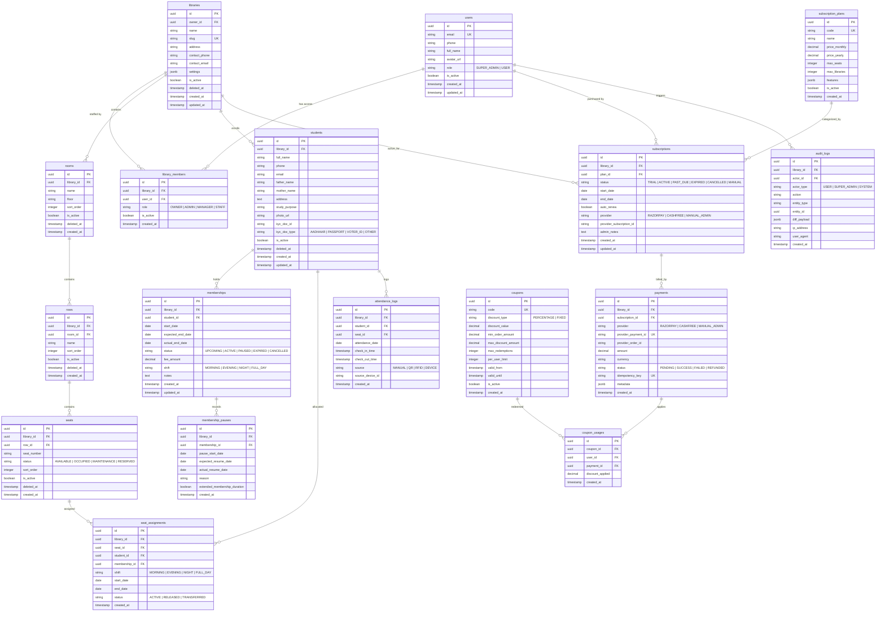

# Database Design Document: Library Management SaaS

## 1. Database Philosophy & Best Practices
* **Database Engine**: PostgreSQL 16+.
* **Primary Keys**: UUIDv7 (time-ordered UUIDs) or standard UUIDv4 for high concurrency, zero sequence lock contention, and safe distributed generation.
* **Multi-Tenancy Guard**: Every tenant resource explicitly references `library_id` with foreign key cascades and composite indexes: `(library_id, id)`.
* **Immutability & Audit**: Never overwrite lifecycle events (seat relocations, attendance, payment transactions, membership pauses). Soft-deletes (`deleted_at TIMESTAMP NULL`) used where appropriate.
* **Data Privacy**: Sensitive identification (Aadhaar, government documents) stored as authenticated Cloudinary identifiers, never raw binary blobs.

---

## 2. Entity-Relationship (ER) Diagram



---

## 3. Detailed Table Specifications & Query Indexing

### 3.1 Tenant & Workspace Tables
```sql
-- Libraries Table
CREATE TABLE libraries (
    id UUID PRIMARY KEY DEFAULT gen_random_uuid(),
    owner_id UUID NOT NULL REFERENCES users(id) ON DELETE RESTRICT,
    name VARCHAR(255) NOT NULL,
    slug VARCHAR(255) UNIQUE NOT NULL,
    address TEXT,
    contact_phone VARCHAR(32) NOT NULL,
    contact_email VARCHAR(255),
    settings JSONB DEFAULT '{}'::jsonb,
    is_active BOOLEAN DEFAULT TRUE,
    deleted_at TIMESTAMPTZ NULL,
    created_at TIMESTAMPTZ DEFAULT CURRENT_TIMESTAMP,
    updated_at TIMESTAMPTZ DEFAULT CURRENT_TIMESTAMP
);

CREATE INDEX idx_libraries_owner ON libraries(owner_id);
CREATE INDEX idx_libraries_slug ON libraries(slug);
CREATE INDEX idx_libraries_active ON libraries(is_active) WHERE deleted_at IS NULL;
```

### 3.2 Inventory Infrastructure (`rooms`, `rows`, `seats`)
```sql
-- Seats Table
CREATE TABLE seats (
    id UUID PRIMARY KEY DEFAULT gen_random_uuid(),
    library_id UUID NOT NULL REFERENCES libraries(id) ON DELETE CASCADE,
    row_id UUID NOT NULL REFERENCES rows(id) ON DELETE CASCADE,
    seat_number VARCHAR(64) NOT NULL,
    status VARCHAR(32) NOT NULL DEFAULT 'AVAILABLE', -- AVAILABLE, OCCUPIED, MAINTENANCE, RESERVED
    sort_order INT NOT NULL DEFAULT 0,
    is_active BOOLEAN DEFAULT TRUE,
    deleted_at TIMESTAMPTZ NULL,
    created_at TIMESTAMPTZ DEFAULT CURRENT_TIMESTAMP,
    CONSTRAINT uq_library_row_seat UNIQUE (library_id, row_id, seat_number)
);

CREATE INDEX idx_seats_library_status ON seats(library_id, status) WHERE deleted_at IS NULL;
CREATE INDEX idx_seats_row ON seats(row_id);
```

### 3.3 Students & KYC Metadata
```sql
CREATE TABLE students (
    id UUID PRIMARY KEY DEFAULT gen_random_uuid(),
    library_id UUID NOT NULL REFERENCES libraries(id) ON DELETE CASCADE,
    full_name VARCHAR(255) NOT NULL,
    phone VARCHAR(32) NOT NULL,
    email VARCHAR(255),
    father_name VARCHAR(255),
    mother_name VARCHAR(255),
    address TEXT,
    study_purpose VARCHAR(255),
    photo_url TEXT,
    kyc_doc_id VARCHAR(255), -- Secure Cloudinary public_id / asset token
    kyc_doc_type VARCHAR(32) DEFAULT 'AADHAAR',
    is_active BOOLEAN DEFAULT TRUE,
    deleted_at TIMESTAMPTZ NULL,
    created_at TIMESTAMPTZ DEFAULT CURRENT_TIMESTAMP,
    updated_at TIMESTAMPTZ DEFAULT CURRENT_TIMESTAMP
);

CREATE INDEX idx_students_library_phone ON students(library_id, phone);
CREATE INDEX idx_students_library_name ON students(library_id, full_name text_pattern_ops);
CREATE INDEX idx_students_library_active ON students(library_id, is_active) WHERE deleted_at IS NULL;
```

### 3.4 Memberships, Pauses & Seat Allocations
```sql
-- Memberships Table
CREATE TABLE memberships (
    id UUID PRIMARY KEY DEFAULT gen_random_uuid(),
    library_id UUID NOT NULL REFERENCES libraries(id) ON DELETE CASCADE,
    student_id UUID NOT NULL REFERENCES students(id) ON DELETE CASCADE,
    start_date DATE NOT NULL,
    expected_end_date DATE NOT NULL,
    actual_end_date DATE,
    status VARCHAR(32) NOT NULL DEFAULT 'ACTIVE', -- UPCOMING, ACTIVE, PAUSED, EXPIRED, CANCELLED
    fee_amount NUMERIC(10, 2) NOT NULL,
    shift VARCHAR(32) NOT NULL DEFAULT 'FULL_DAY', -- MORNING, EVENING, NIGHT, FULL_DAY
    notes TEXT,
    created_at TIMESTAMPTZ DEFAULT CURRENT_TIMESTAMP,
    updated_at TIMESTAMPTZ DEFAULT CURRENT_TIMESTAMP
);

-- Compound index for fast dashboard expiration queries
CREATE INDEX idx_memberships_dashboard_exp ON memberships(library_id, status, expected_end_date);
CREATE INDEX idx_memberships_student ON memberships(student_id);

-- Seat Assignments (Historical Tracking)
CREATE TABLE seat_assignments (
    id UUID PRIMARY KEY DEFAULT gen_random_uuid(),
    library_id UUID NOT NULL REFERENCES libraries(id) ON DELETE CASCADE,
    seat_id UUID NOT NULL REFERENCES seats(id) ON DELETE RESTRICT,
    student_id UUID NOT NULL REFERENCES students(id) ON DELETE CASCADE,
    membership_id UUID NOT NULL REFERENCES memberships(id) ON DELETE CASCADE,
    shift VARCHAR(32) NOT NULL DEFAULT 'FULL_DAY',
    start_date DATE NOT NULL,
    end_date DATE,
    status VARCHAR(32) NOT NULL DEFAULT 'ACTIVE', -- ACTIVE, RELEASED, TRANSFERRED
    created_at TIMESTAMPTZ DEFAULT CURRENT_TIMESTAMP
);

-- Prevent two students from having an ACTIVE assignment on the same seat for the same shift concurrently
CREATE UNIQUE INDEX uq_active_seat_shift ON seat_assignments(seat_id, shift) WHERE (status = 'ACTIVE');
CREATE INDEX idx_seat_assignments_library_student ON seat_assignments(library_id, student_id, status);
```

### 3.5 Attendance Logs
```sql
CREATE TABLE attendance_logs (
    id UUID PRIMARY KEY DEFAULT gen_random_uuid(),
    library_id UUID NOT NULL REFERENCES libraries(id) ON DELETE CASCADE,
    student_id UUID NOT NULL REFERENCES students(id) ON DELETE CASCADE,
    seat_id UUID REFERENCES seats(id) ON DELETE SET NULL,
    attendance_date DATE NOT NULL DEFAULT CURRENT_DATE,
    check_in_time TIMESTAMPTZ NOT NULL DEFAULT CURRENT_TIMESTAMP,
    check_out_time TIMESTAMPTZ,
    source VARCHAR(32) NOT NULL DEFAULT 'MANUAL', -- MANUAL, QR, RFID, DEVICE
    source_device_id VARCHAR(128),
    created_at TIMESTAMPTZ DEFAULT CURRENT_TIMESTAMP
);

CREATE INDEX idx_attendance_daily ON attendance_logs(library_id, attendance_date);
CREATE INDEX idx_attendance_student ON attendance_logs(student_id, attendance_date DESC);
CREATE UNIQUE INDEX uq_student_daily_attendance ON attendance_logs(library_id, student_id, attendance_date);
```

### 3.6 Payments, Subscriptions & Audit
```sql
CREATE TABLE payments (
    id UUID PRIMARY KEY DEFAULT gen_random_uuid(),
    library_id UUID NOT NULL REFERENCES libraries(id) ON DELETE RESTRICT,
    subscription_id UUID REFERENCES subscriptions(id) ON DELETE RESTRICT,
    provider VARCHAR(32) NOT NULL, -- RAZORPAY, CASHFREE, MANUAL_ADMIN
    provider_payment_id VARCHAR(128),
    provider_order_id VARCHAR(128),
    amount NUMERIC(10, 2) NOT NULL,
    currency VARCHAR(8) NOT NULL DEFAULT 'INR',
    status VARCHAR(32) NOT NULL, -- PENDING, SUCCESS, FAILED, REFUNDED
    idempotency_key VARCHAR(128) UNIQUE NOT NULL,
    metadata JSONB DEFAULT '{}'::jsonb,
    created_at TIMESTAMPTZ DEFAULT CURRENT_TIMESTAMP
);

CREATE INDEX idx_payments_library ON payments(library_id);
CREATE INDEX idx_payments_provider_order ON payments(provider, provider_order_id);

CREATE TABLE audit_logs (
    id UUID PRIMARY KEY DEFAULT gen_random_uuid(),
    library_id UUID REFERENCES libraries(id) ON DELETE CASCADE,
    actor_id UUID NOT NULL,
    actor_type VARCHAR(32) NOT NULL, -- USER, SUPER_ADMIN, SYSTEM
    action VARCHAR(128) NOT NULL,
    entity_type VARCHAR(64) NOT NULL,
    entity_id UUID NOT NULL,
    diff_payload JSONB DEFAULT '{}'::jsonb,
    ip_address VARCHAR(45),
    user_agent TEXT,
    created_at TIMESTAMPTZ DEFAULT CURRENT_TIMESTAMP
);

CREATE INDEX idx_audit_library_created ON audit_logs(library_id, created_at DESC);
CREATE INDEX idx_audit_entity ON audit_logs(entity_type, entity_id);
```

---

## 4. Query Performance & N+1 Prevention
* **Prisma Relations with Explicit Selects**: Avoid blanket query joins. Use strict DTO projections to prevent loading Aadhaar KYC or heavy diff payloads on simple list screens.
* **Database Views for Dashboard**: Materialized or composite SQL queries for dashboard counters:
  ```sql
  SELECT
    COUNT(*) FILTER (WHERE status = 'ACTIVE') AS total_active_students,
    COUNT(*) FILTER (WHERE status = 'ACTIVE' AND expected_end_date <= CURRENT_DATE + INTERVAL '5 days') AS ending_soon_count,
    COUNT(*) FILTER (WHERE status = 'EXPIRED') AS expired_count
  FROM memberships
  WHERE library_id = :current_library_id;
  ```
