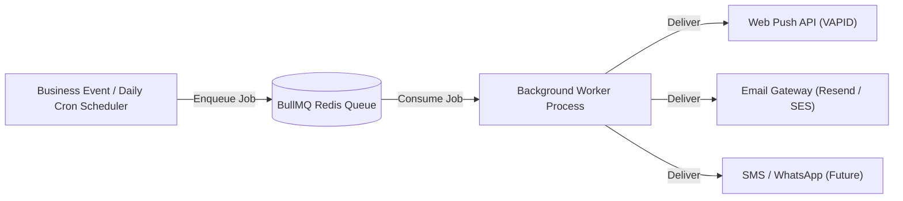

# ADR-006: Asynchronous Queue-Based Notification Architecture

## Status
Accepted

## Context
The platform needs to deliver mission-critical, time-sensitive notifications to library owners and students:
* Membership expiration notices (at 7 days, 5 days, 1 day, and on expiry).
* Payment receipts and renewal alerts.
* Subscription past-due notices.
* Emergency library announcements.

Executing push notifications, emails, or SMS synchronously inside HTTP request-response cycles causes sluggish UX, request timeouts, and failure vulnerabilities if third-party providers experience latency.

## Decision
We decouple notification triggers from notification delivery using **Redis + BullMQ background job queues**:

1. **Daily Cron Scheduler**: Runs at midnight server time, querying active memberships reaching their expiration thresholds (7d, 5d, 1d) and batch enqueuing notification jobs.
2. **Event-Driven Enqueueing**: Payment successes/failures immediately push discrete notification tasks onto the queue.
3. **Dedicated Worker Process**: The worker runs out-of-band with automatic retry backoff (exponential backoff with jitter) to tolerate external gateway downtime.

## Consequences
### Positive:
* Non-blocking, instant HTTP response times for API consumers.
* Resilient to third-party network blips with automatic retries and dead-letter queues.
* Scalable: Worker concurrency can be tuned independently of the main API server.

### Negative:
* Requires Redis infrastructure (already required for OTP and session management).
* Asynchronous eventual delivery requires proper status tracking.
