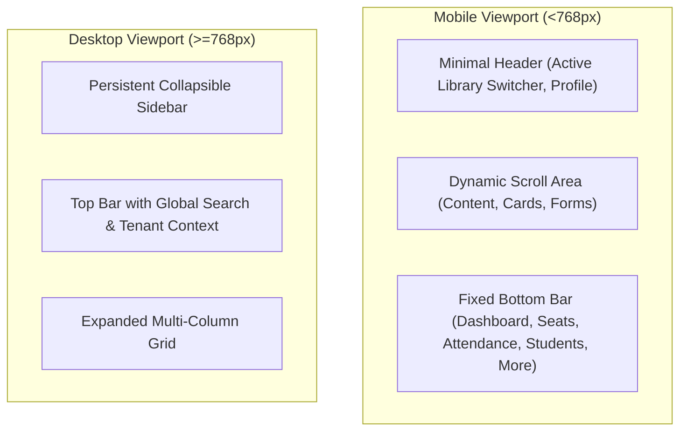
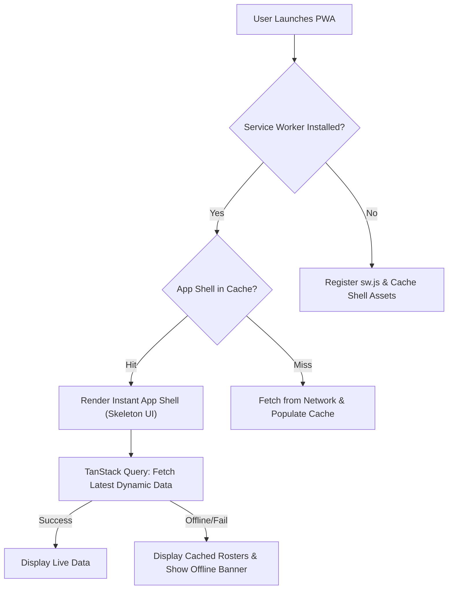

# Frontend Architecture & Mobile-First UX: Library Management SaaS

## 1. Design Philosophy: Mobile-First Commercial SaaS

The frontend is engineered as a **mobile-first Progressive Web Application (PWA)** built on **Next.js 15 (App Router)**.
Target users (library owners) operate on their smartphones while walking through halls or seated at reception desks.

### Core Principles:
* **Glanceable & Actionable**: Critical indicators (Seats Free, Ending Soon, Present Today) visible without scrolling.
* **Thumb-Zone Optimization**: Primary navigation located at the bottom of the viewport; primary actions reachable with one thumb.
* **Tactile & Responsive**: Generous touch targets ($\ge 48\text{px}$), clear tap feedback, and zero micro-stutters.
* **No AI/CRUD Aesthetic**: Polished neutral palettes, crisp typography (Inter/Geist), balanced borders, and meaningful skeleton states instead of generic spinners.
* **Offline-Resilient App Shell**: Cached UI shell allows owners to launch the app instantly even on intermittent connectivity.

---

## 2. Navigation Architecture

### Bottom Navigation Bar Tabs:
1. **Home / Dashboard**: Key metrics, action queues (expiring memberships, fee dues).
2. **Seats**: Visual grid layout of rooms, rows, seat cards with status chips (`Green = Free`, `Blue = Occupied`, `Amber = Ending Soon`).
3. **Attendance**: Fast tap-to-check-in student roster with search.
4. **Students**: Alphabetical directory with quick call/WhatsApp and status badges.
5. **More**: Subscriptions, Settings, Kanban Tasks, Audit History.

---

## 3. Technology Stack & State Management

| Concern | Solution | Purpose |
| :--- | :--- | :--- |
| **Framework** | Next.js 15 (App Router) | Server Components for initial load speed, SSR for SEO/landing, Client Components for interactive forms. |
| **Styling** | Tailwind CSS + CSS Variables | Fast mobile styling, theme tokens, dark/light ready. |
| **Component Primitives** | shadcn/ui (Radix UI) | Accessible, headless, customizable touch-friendly primitives. |
| **Server State** | TanStack Query v5 | Automatic background refetching, optimistic UI updates, request deduplication. |
| **Client/Local State** | Zustand | Active `currentLibraryId`, sidebar collapse, active filter state. |
| **Form Handling** | React Hook Form + Zod | Lightweight multi-step forms with client-side schema validation. |
| **Image Delivery** | Next/Image + Cloudinary SDK | Automatic responsive WebP/AVIF generation, direct upload widgets. |

---

## 4. Key Mobile UX Flows

### 4.1 Step-Based Student Registration Form
Rather than a daunting single-page 15-field desktop form, the mobile experience is divided into 3 intuitive steps:
* **Step 1: Personal Profile** (Name, Phone, Email, Purpose of Study).
* **Step 2: KYC & Identification** (Photo capture/upload, Aadhaar upload with direct Cloudinary signed integration).
* **Step 3: Initial Membership & Seat Selection** (Plan duration, shift selection, seat picker grid).

### 4.2 Visual Seat Map (Interactive Grid)
* Grouped by **Room** $\to$ **Row**.
* Visual seat indicators:
  * 🟢 Green: Vacant / Available for allocation.
  * 🔵 Blue: Occupied (shows student avatar/initials on tap).
  * 🟡 Amber: Membership expiring within 5 days.
  * 🔴 Red: Maintenance / Out of order.
* Tap on seat reveals a **Bottom Sheet Modal** with one-tap actions: "Assign Student", "Relocate", "Mark Maintenance".

### 4.3 Reusable Touch Kanban
* Implemented using `@hello-pangea/dnd` or touch-friendly lightweight HTML5 pointer events.
* Columns: "Inquiry", "Pending KYC", "Fee Due", "Active", "Alumni".
* Horizontal swipe between columns on mobile with sticky column headers.
* Optimistic UI updating: Cards move instantly while backend persists position.

---

## 5. PWA & Offline Strategy

### Caching Rules:
* **App Shell & Static Assets**: Cache-first strategy (`/_next/static/*`, `/icons/*`, `/manifest.json`).
* **API Dynamic Data**: Network-first with IndexedDB/Stale-While-Revalidate fallback.
* **Sensitive KYC & Documents**: **NETWORK ONLY (NO CACHE)**. Never cached in Service Worker storage to prevent device-level Aadhaar leaks.
* **Push Notifications**: Web Push API listening in Service Worker for background notifications (membership alerts, subscription renewals).
