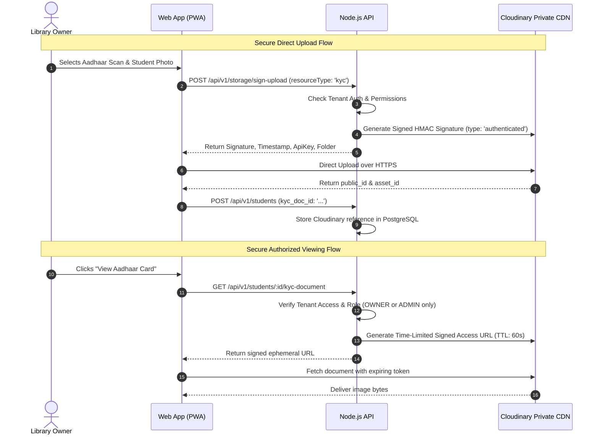

# Security Model & Threat Mitigation: Library Management SaaS

## 1. Overview & Threat Vectors
The Library Management SaaS platform stores sensitive identity documents (Aadhaar cards, photos), tenant financial data, and personal student information. This document outlines the defense-in-depth architecture guarding against unauthorized access, data leaks, and malicious exploitation.

---

## 2. Multi-Tenant Isolation & IDOR Protection

### 2.1 Backend Tenant Enforcement
* **Zero Trust Frontend**: The client cannot request a student or seat simply by UUID without an authorized tenant context.
* **Double-Check Principle**:
  Every database query within tenant routes includes both the entity's UUID and the verified tenant ID:
  ```typescript
  // SECURE: Tenant-scoped lookup prevents Insecure Direct Object Reference (IDOR)
  const student = await prisma.student.findFirst({
    where: {
      id: studentId,
      libraryId: req.tenant.libraryId, // Enforced from authenticated context
      deletedAt: null,
    },
  });
  if (!student) throw new NotFoundError('Student not found');
  ```
* **Tenant Context Middleware**:
  1. Validates JWT Bearer token.
  2. Extracts `X-Library-Id` header (or route param).
  3. Checks membership in `library_members` table with active status.
  4. Binds `req.tenant = { libraryId, userId, role }` to execution context.

---

## 3. Sensitive KYC & Aadhaar Data Protection

Aadhaar documents are legally sensitive. Storing or exposing them publicly can result in heavy liability.



* **No Public URLs**: KYC assets are tagged with access mode `authenticated`/`private` in Cloudinary.
* **Ephemeral Delivery**: Presigned URLs expire after 60 seconds.
* **Zero PWA Cache**: Service worker cache rules explicitly exclude `/kyc-document` and Cloudinary private delivery endpoints.

---

## 4. Authentication & Session Security

### 4.1 Email OTP Hardening
* **Storage**: Redis-backed with key `otp:{email}`.
* **Cryptographic Salt & Hash**: The 6-digit numeric OTP is generated via `crypto.randomInt(100000, 999999)` and stored hashed using `argon2` or `bcrypt` in Redis. Plaintext OTP is NEVER stored in database or Redis.
* **Strict Expiration**: 5-minute TTL.
* **Rate Limiting**:
  * Max 3 OTP requests per 15 minutes per IP/Email.
  * Max 5 invalid verification attempts before lock-out.
  * Automatic cooldown period.

### 4.2 Google OAuth Verification
* Authorization code exchanged server-side via Google's OAuth API.
* Token `aud` and `iss` verified against registered Google Cloud project client IDs.

### 4.3 JWT & Token Management
* **Access Tokens**: Short-lived (15 minutes), containing minimal payload (`userId`, `role`).
* **Refresh Tokens**: Stored in `HttpOnly`, `Secure`, `SameSite=Lax` cookies, with database-backed token family tracking and automatic rotation to thwart token replay attacks.

---

## 5. Payment Webhook Security & Idempotency

* **HMAC Signature Verification**:
  * Razorpay: Verified using `crypto.createHmac('sha256', secret).update(rawBody).digest('hex')`.
  * Cashfree: Verified against raw signature payload with public gateway keys.
* **Raw Body Preservation**: Express middleware configured to capture raw JSON buffer specifically for `/api/v1/payments/webhook`.
* **Idempotency Keying**:
  * Every webhook event calculates `idempotency_key = ${provider}_${event_id || payment_id}`.
  * Inserted into `webhook_events` with unique constraint inside a database transaction.
  * Duplicate deliveries return immediate `200 OK` without side effects.

---

## 6. Audit Logging System

Every security-sensitive or administrative state mutation writes an immutable audit log:

```typescript
export interface AuditRecord {
  libraryId?: string;      // null for global platform admin actions
  actorId: string;
  actorType: 'USER' | 'SUPER_ADMIN' | 'SYSTEM';
  action:
    | 'STUDENT_CREATED'
    | 'STUDENT_ARCHIVED'
    | 'SEAT_ASSIGNED'
    | 'SEAT_CHANGED'
    | 'MEMBERSHIP_EXTENDED'
    | 'MEMBERSHIP_PAUSED'
    | 'SUBSCRIPTION_MANUAL_ACTIVATED'
    | 'COUPON_CREATED'
    | 'COUPON_DISABLED'
    | 'ADMIN_TENANT_SUSPENDED';
  entityType: string;
  entityId: string;
  diffPayload: Record<string, { before: unknown; after: unknown }>;
  ipAddress: string;
  userAgent: string;
}
```

* Logs are append-only.
* Protected against deletion through restricted database role grants.
