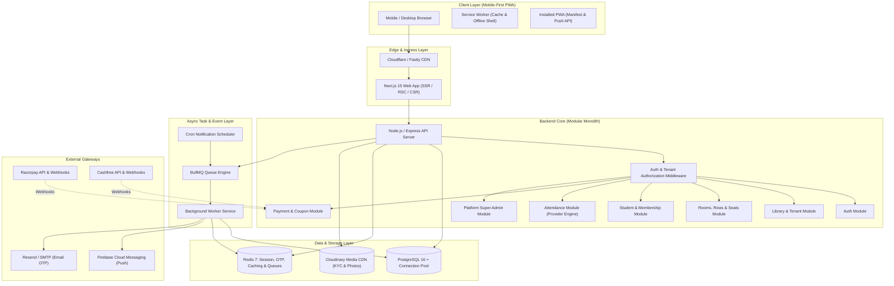
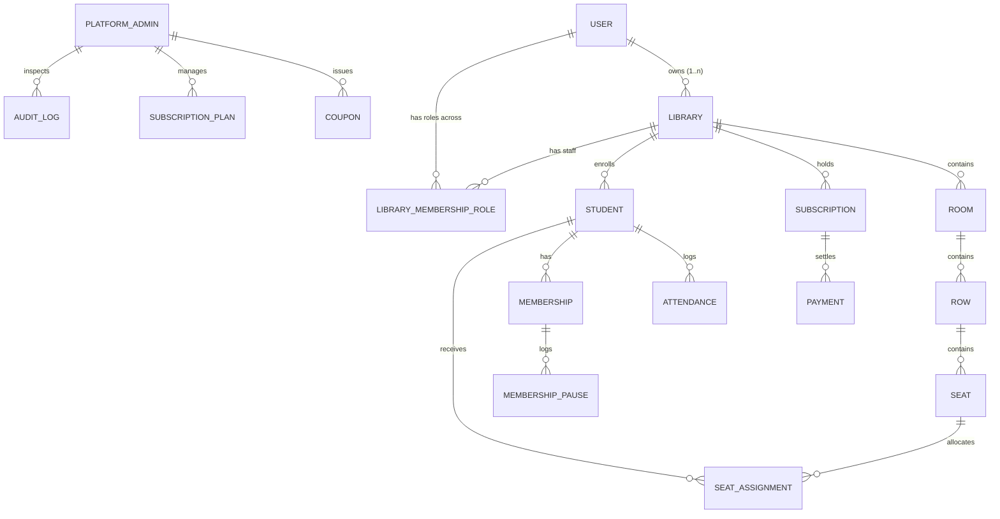
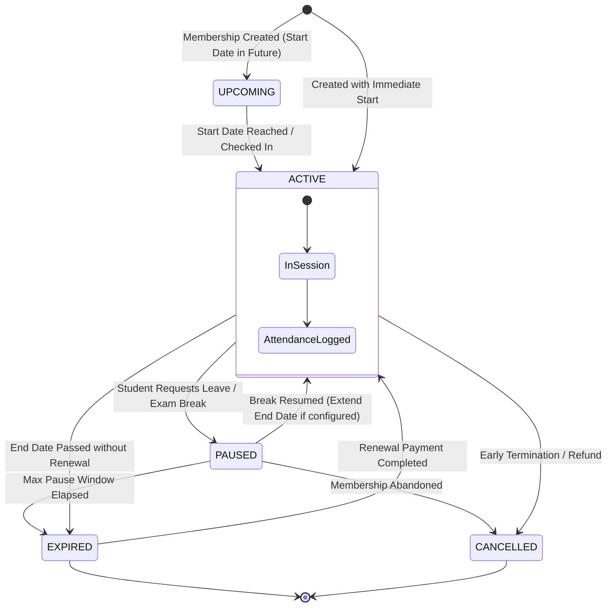
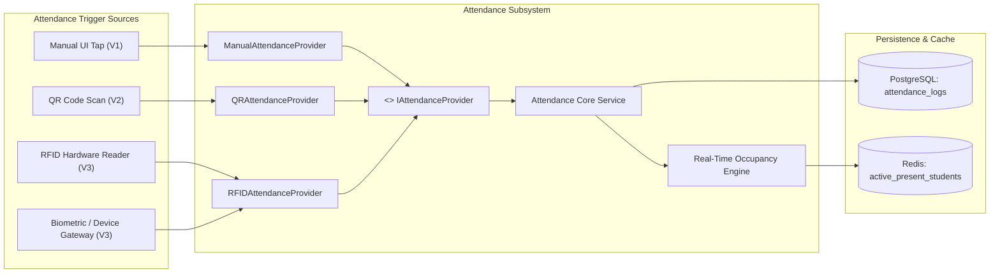
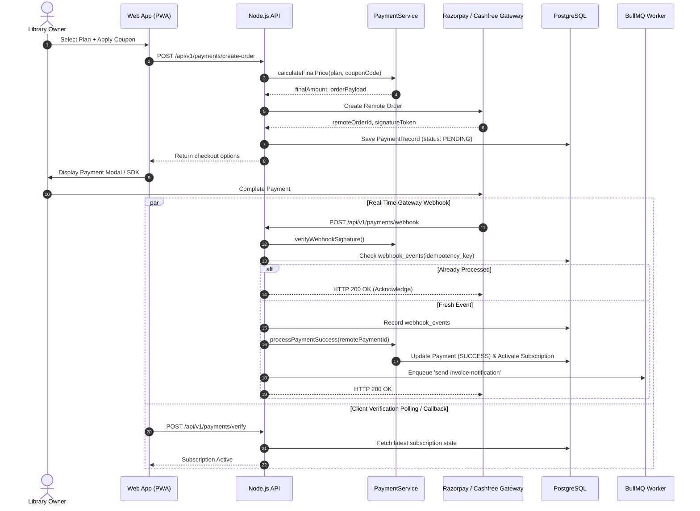
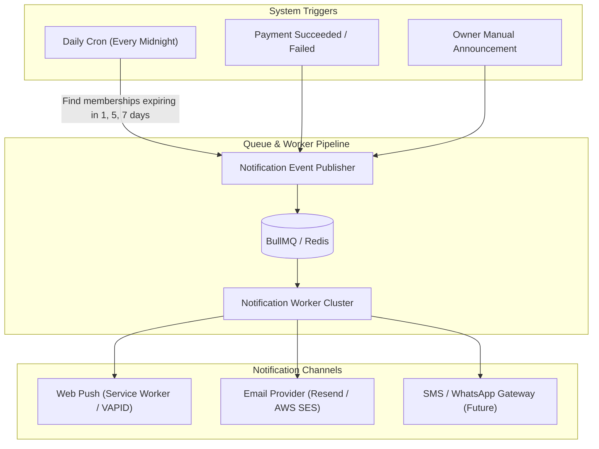
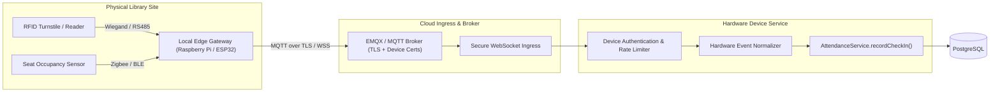

# System Architecture Document: Library Management SaaS

## 1. High-Level Architecture Overview

The Library Management SaaS platform is designed as a **Modular Monolith** with clear architectural boundaries, asynchronous task execution via Redis queues, and clean provider abstractions.



---

## 2. Multi-Tenancy Architecture

Multi-tenancy uses a **Pooled Schema with Discriminator Column (`library_id`)** reinforced by strict Backend Context Middleware and Row-Level security boundaries.



### Tenant Enforcement Flow
1. **Authentication Token**: The JWT contains `user_id` and global claims.
2. **Context Determination**: Requests to library resources pass `X-Library-Id` header (or `:libraryId` route param).
3. **TenantGuard Middleware**:
   * Resolves whether `user_id` is an `OWNER`, `ADMIN`, `STAFF` of `library_id` or a global `PLATFORM_SUPER_ADMIN`.
   * Attaches validated `TenantContext { user, library, role }` to request context.
   * If unauthorized or mismatched, immediately rejects with `403 Forbidden` and logs a security event.
4. **Data Layer Scoping**: Every query to tenant-scoped tables (`students`, `seats`, `attendance`, `memberships`) mandates `WHERE library_id = :current_library_id`.

---

## 3. Student Membership Lifecycle



---

## 4. Attendance Architecture & Provider Abstraction

The attendance subsystem is decoupled via an **Event & Strategy Provider Pattern**.



### Contract Definition (`IAttendanceProvider`)
```typescript
export interface AttendanceCheckinDTO {
  libraryId: string;
  studentId: string;
  source: 'MANUAL' | 'QR' | 'RFID' | 'DEVICE';
  sourceDeviceId?: string;
  seatId?: string;
  timestamp: Date;
  metadata?: Record<string, unknown>;
}

export interface IAttendanceProvider {
  readonly providerType: 'MANUAL' | 'QR' | 'RFID' | 'DEVICE';
  recordCheckIn(dto: AttendanceCheckinDTO): Promise<AttendanceResult>;
  recordCheckOut(dto: AttendanceCheckinDTO): Promise<AttendanceResult>;
}
```

---

## 5. Payment & Subscription Architecture

Unified multi-gateway architecture supporting Razorpay, Cashfree, and Manual Platform Admin Overrides with strict webhook deduplication.



---

## 6. Asynchronous Notification Architecture



---

## 7. Future Hardware & RFID Turnstile Gateway (V3 Architecture)

To ensure zero architectural rewrites when introducing physical hardware:



* Because V1 treats `AttendanceProvider` and `Seat.id` as canonical stable entities, physical hardware simply connects through an edge gateway into the existing `AttendanceService`.
