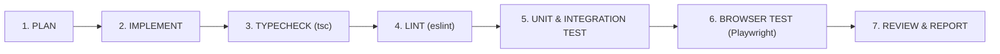

# Testing & Quality Assurance Strategy: Library Management SaaS

## 1. QA Philosophy
In a multi-tenant SaaS handling financial payments and sensitive identity documents, bugs can result in financial loss or cross-tenant data leaks. Testing is treated as a first-class citizen.

### Verification Cycle for Every Implementation Phase:


No phase will be marked complete until all stages of this verification cycle succeed.

---

## 2. Test Classification & Coverage Targets

| Test Level | Tools | Scope & Key Targets | Target Coverage |
| :--- | :--- | :--- | :--- |
| **Unit Tests** | Vitest | Validation schemas (Zod), coupon discount math, date/shift overlap logic, JWT utilities. | $\ge 85\%$ of domain logic |
| **Integration Tests** | Vitest + Supertest + Testcontainers (Postgres/Redis) | API controllers, TenantGuard middleware, database queries, webhook handlers. | $\ge 80\%$ of API routes |
| **E2E & Mobile Tests**| Playwright | Full critical paths on mobile viewport (iPhone 14 / Pixel 7 emulation): Login, Student KYC, Seat Assign, Attendance. | 100% of Core User Journeys |
| **Security Tests** | Custom Security Harness | Cross-tenant isolation verification, IDOR probes, expired OTP brute-force rejection. | Zero tolerance for leaks |

---

## 3. High-Priority Test Suites

### 3.1 Multi-Tenant Isolation Suite (`tenant-isolation.spec.ts`)
* **Objective**: Guarantee that Library A's owner or staff can NEVER read or manipulate Library B's records.
* **Test Cases**:
  1. User A authenticated with `X-Library-Id: Library-A` attempts `GET /api/v1/students/{StudentInLibraryB}` $\to$ Expect `403 Forbidden` or `404 Not Found`.
  2. Attempting to assign Seat from Library B to Student in Library A $\to$ Expect `400 / 422 Rejection`.
  3. Querying attendance roster with mismatched header $\to$ Returns empty list or `403`.

### 3.2 Webhook Idempotency & Signature Suite (`payment-webhook.spec.ts`)
* **Objective**: Prevent duplicate balance credits, double extensions, or fraudulent subscription activations.
* **Test Cases**:
  1. Valid Razorpay `payment.captured` webhook $\to$ Expect `200 OK`, Subscription activated.
  2. Identical webhook delivered a second and third time $\to$ Expect `200 OK`, zero duplicate rows in database, subscription validity untouched.
  3. Webhook with invalid or forged HMAC signature $\to$ Expect `400 Bad Request`, security alert logged.

### 3.3 Date & Pause Calculation Suite (`membership-lifecycle.spec.ts`)
* **Objective**: Ensure date calculations for 5-day, 7-day warnings and pause extensions are mathematically exact across calendar boundaries and leap years.
* **Test Cases**:
  1. Student starts Feb 1, expected end Mar 1. Pause 5 days (Feb 10 - Feb 15). Resume $\to$ verify updated `expected_end_date` is Mar 6.
  2. Query expiring memberships filter $\to$ correctly flags memberships expiring within today, 5 days, and 7 days.

---

## 4. Automated CI/CD Pipeline
```yaml
# Conceptual GitHub Actions Workflow
name: Verification Pipeline
on: [push, pull_request]
jobs:
  verify:
    runs-on: ubuntu-latest
    steps:
      - uses: actions/checkout@v4
      - uses: pnpm/action-setup@v3
      - uses: actions/setup-node@v4
      - run: pnpm install --frozen-lockfile
      - run: pnpm run typecheck
      - run: pnpm run lint
      - run: pnpm run test:unit
      - run: pnpm run test:integration
      - run: pnpm run test:e2e
```
