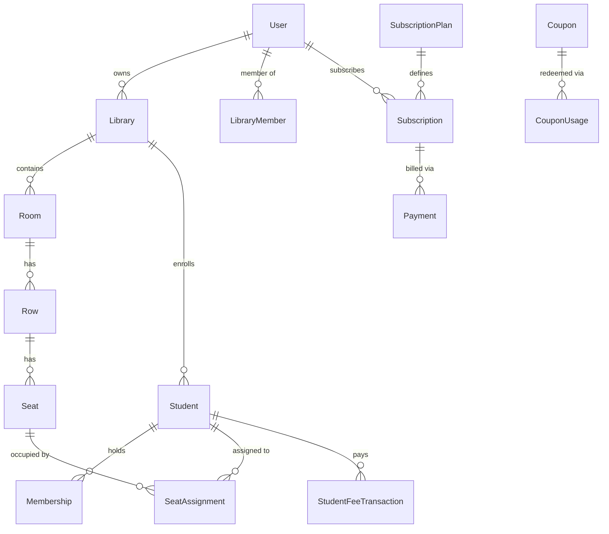

# seeLibrary — Technical Architecture, Directory Structure, Database Schema & API Reference

---

## 1. Monorepo Architecture & Directory Map

**seeLibrary** is structured as a high-performance monorepo managed via **Turborepo** and **pnpm**:

```
seeLibrary (Monorepo Root)
├── apps/
│   └── web/                                  # Next.js 15 App Router Frontend & Fullstack API Routes
│       ├── public/                           # Static assets, icons, manifest.json, sw.js
│       └── src/
│           ├── app/                          # Next.js App Router (Pages & API Route Handlers)
│           │   ├── admin/                    # Platform Super Admin Portal Page
│           │   ├── api/                      # 45 Serverless REST Route Handlers
│           │   ├── user/                     # Student / Public Member Self-Service Portal
│           │   ├── layout.tsx                # Root HTML, Fonts, Theme Provider, PWA Meta
│           │   ├── page.tsx                  # Core Single-Page Library Operations Dashboard
│           │   ├── loading.tsx               # Global SSR hydration skeleton
│           │   └── not-found.tsx             # 404 Fallback page
│           ├── components/                   # 28 Reusable UI Components & Dialog Modals
│           └── lib/                          # Client utilities, storage helpers & auth sync
├── packages/
│   ├── database/                             # Prisma ORM schema, client singleton & migrations
│   │   ├── prisma/schema.prisma              # PostgreSQL relational data definitions
│   │   └── src/index.ts                      # Prisma client export
│   ├── types/                                # Shared TypeScript interfaces & business models
│   │   └── src/index.ts
│   └── config/                               # Shared ESLint, Prettier & TypeScript configs
├── package.json                              # Workspace root scripts & dependencies
├── turbo.json                                # Pipeline caching & task orchestrator
├── workflow.md                               # Business logic & domain workflows specification
└── structure.md                              # Technical architecture, tables & API directory
```

---

## 2. Frontend Architecture & Component Directory

The web frontend is built with **React 19**, **Next.js 15 (App Router)**, **Tailwind CSS v4**, and **Lucide Icons**.

### 2.1 Route Entrypoints (`apps/web/src/app`)

| Route Entrypoint | Path | Description & User Role |
| :--- | :--- | :--- |
| **Landing & Main Dashboard** | `src/app/page.tsx` | Dynamic entrypoint: renders Public Landing Page for unauthenticated visitors, and the full multi-branch management console for authenticated library owners and managers. |
| **Super Admin Platform Console** | `src/app/admin/page.tsx` | Platform governance hub for system administrators to control plans, view GMV metrics, approve libraries, adjust coupons, and broadcast notifications. |
| **Student / User Self-Service** | `src/app/user/page.tsx` | Dedicated student portal for members to check seat status, study hours, active subscription validity, and payment receipts. |
| **Root Layout** | `src/app/layout.tsx` | Injects viewport metadata, dark/light theme providers, web manifest links, and PWA service worker registrations. |

---

### 2.2 Reusable UI Components & Modals (`apps/web/src/components`)

```
┌────────────────────────────────────────────────────────────────────────┐
│                        CORE COMPONENT HIERARCHY                        │
├────────────────────────────────────────────────────────────────────────┤
│ • page.tsx (Dashboard Controller)                                      │
│   ├── DesktopSidebar.tsx              (Collapsible navigation)         │
│   ├── SeatGrid.tsx                    (Interactive desk matrix)        │
│   ├── StudentList.tsx                 (Student directory table)        │
│   ├── KanbanBoard.tsx                 (Admissions lead pipeline)       │
│   ├── TransactionsView.tsx            (Fee ledger & financial history) │
│   ├── DashboardChart.tsx              (Occupancy & revenue visualizer) │
│   └── PWACompanion.tsx                (Service worker & push manager)  │
│                                                                        │
│ • Modal Dialogs & Action Overlays                                      │
│   ├── AuthModal.tsx                   (Phone OTP login/signup)         │
│   ├── CreateLibraryModal.tsx          (New branch creation wizard)     │
│   ├── EditLibraryModal.tsx            (Branch settings & contacts)     │
│   ├── RoomRowModal.tsx                (Add physical study room)        │
│   ├── AddRowModal.tsx                 (Add row & batch desks)          │
│   ├── BatchSeatModal.tsx              (Expand seats in row/room)       │
│   ├── EditRoomModal.tsx               (Rename/reconfigure room)        │
│   ├── StudentModal.tsx                (Student admission & KYC form)   │
│   ├── AssignSeatModal.tsx             (Seat & shift assignment dialog) │
│   ├── StudentProfileModal.tsx         (Student 360-degree view)        │
│   ├── CollectFeeModal.tsx             (Collect monthly fee & dues)     │
│   ├── FeeReceiptModal.tsx             (Tax invoice & WhatsApp receipt) │
│   ├── SubscriptionCard.tsx            (SaaS plan selection & billing)  │
│   ├── SubscriptionRequiredModal.tsx   (Feature-gating & upgrade modal) │
│   └── NotificationCenterModal.tsx     (Push notification inbox)        │
└────────────────────────────────────────────────────────────────────────┘
```

#### Detailed Component Responsibilities:
1. **`SeatGrid.tsx`**:
   - Renders interactive seat layouts grouped by Room and Row.
   - Highlights desk status (Available, Occupied, Maintenance, Reserved) and locker icons (`🔐`).
   - Supports multi-shift occupants (Morning 🌅, Evening 🌇, Full Day ☀️).
   - Provides quick "+ Seat" and "Delete Row" actions scoped to specific rooms.
2. **`StudentList.tsx`**:
   - Filterable directory of all enrolled students with search by name, phone, or seat number.
   - Status indicators (Active, Inactive, Expiring Soon, Expired).
   - Quick action triggers for Fee Collection, Seat Re-assignment, and Profile Drawer.
3. **`KanbanBoard.tsx`**:
   - Drag-and-drop / stage-change admission pipeline (Inquiry ➔ Demo ➔ Enrolled ➔ Inactive).
4. **`BatchSeatModal.tsx`**:
   - Dialog to batch-generate seats for a designated room and row.
   - Allows selecting starting numbers, prefix formats (e.g., `S-`), seat count, and book locker amenities.
5. **`CollectFeeModal.tsx`**:
   - Handles partial and full fee collections, due calculations, duration selection, payment modes (UPI, Cash, Card), and validity auto-extension.
6. **`FeeReceiptModal.tsx`**:
   - Generates responsive, printable digital receipts and formatted WhatsApp sharing links.
7. **`AdminDashboard.tsx`**:
   - Super admin console widgets: Revenue KPIs, Tenant Library table, User management, Plan editor, and Coupon generator.
8. **`PWACompanion.tsx`**:
   - Handles PWA installation prompts, offline cache synchronization, and Web Push VAPID subscriptions.

---

## 3. Database Schema & Relational Models (PostgreSQL + Prisma)

The database layer is managed through **Prisma ORM** with 18 relational models:



### 3.1 Model Specifications

#### 1. `User` (`users`)
- **Purpose**: System identity (Owners, Staff, Students, Super Admins).
- **Fields**: `id` (UUID), `email` (Unique), `phone`, `fullName`, `avatarUrl`, `role` (`USER`, `SUPER_ADMIN`), `isActive`, timestamps.

#### 2. `Library` (`libraries`)
- **Purpose**: Study center branch / tenant entity.
- **Fields**: `id` (UUID), `ownerId` (FK User), `name`, `slug` (Unique), `address`, `contactPhone`, `contactEmail`, `settings` (JSON), `isActive`, `deletedAt`, timestamps.

#### 3. `LibraryMember` (`library_members`)
- **Purpose**: Multi-user branch staff assignments.
- **Fields**: `id`, `libraryId`, `userId`, `role` (`OWNER`, `ADMIN`, `MANAGER`, `STAFF`), `isActive`.

#### 4. `Room` (`rooms`)
- **Purpose**: Physical hall or zone (e.g., Silent Hall, First Floor).
- **Fields**: `id`, `libraryId`, `name`, `floor`, `sortOrder`, `isActive`, `deletedAt`.

#### 5. `Row` (`rows`)
- **Purpose**: A row of seats within a specific room.
- **Fields**: `id`, `libraryId`, `roomId` (FK Room), `name` (e.g., Row A), `hasLocker`, `sortOrder`, `isActive`.

#### 6. `Seat` (`seats`)
- **Purpose**: Physical study desk.
- **Fields**: `id`, `libraryId`, `rowId` (FK Row), `seatNumber` (e.g., "01"), `status` (`AVAILABLE`, `OCCUPIED`, `MAINTENANCE`, `RESERVED`), `hasLocker`, `sortOrder`, `isActive`.

#### 7. `Student` (`students`)
- **Purpose**: Enrolled student profile and KYC.
- **Fields**: `id`, `libraryId`, `fullName`, `phone`, `email`, `fatherName`, `motherName`, `address`, `studyPurpose`, `photoUrl`, `kycDocId`, `kycDocType` (`AADHAAR`, `PASSPORT`, `VOTER_ID`, `OTHER`), `kycPhotoUrl`, `isActive`.

#### 8. `Membership` (`memberships`)
- **Purpose**: Subscription period of a student in a library.
- **Fields**: `id`, `libraryId`, `studentId`, `startDate`, `expectedEndDate`, `actualEndDate`, `status` (`UPCOMING`, `ACTIVE`, `PAUSED`, `EXPIRED`, `CANCELLED`), `feeAmount`, `shift` (`FULL_DAY`, `MORNING`, `EVENING`, `NIGHT`, `FOUR_HOURS`, `HALF_DAY`), `notes`.

#### 9. `MembershipPause` (`membership_pauses`)
- **Purpose**: Temporary hold on student membership (e.g., exam leave).
- **Fields**: `id`, `libraryId`, `membershipId`, `pauseStartDate`, `expectedResumeDate`, `actualResumeDate`, `reason`, `extendedMembershipDuration`.

#### 10. `SeatAssignment` (`seat_assignments`)
- **Purpose**: Relational link between a physical desk, a student, and a shift.
- **Fields**: `id`, `libraryId`, `seatId`, `studentId`, `membershipId`, `shift`, `startDate`, `endDate`, `status` (`ACTIVE`, `RELEASED`, `TRANSFERRED`).

#### 11. `StudentFeeTransaction` (`student_fee_transactions`)
- **Purpose**: Ledger of all student fee collections, partial dues, and receipts.
- **Fields**: `id`, `libraryId`, `studentId`, `membershipId`, `amount`, `totalFee`, `remainingFee`, `paidForMonth`, `paymentDate`, `validFrom`, `validTo`, `paymentMode` (UPI, CASH, CARD), `status` (PAID, PARTIAL), `receiptNumber`, `notes`.

#### 12. `SubscriptionPlan` (`subscription_plans`)
- **Purpose**: SaaS pricing tiers for library owners.
- **Fields**: `id`, `code` (Unique), `name`, `priceMonthly`, `priceYearly`, `maxSeats`, `maxLibraries`, `features` (JSON), `isActive`.

#### 13. `Subscription` (`subscriptions`)
- **Purpose**: Library owner's active billing contract with the SaaS platform.
- **Fields**: `id`, `libraryId`, `planId`, `userId`, `status` (`TRIAL`, `ACTIVE`, `PAST_DUE`, `EXPIRED`, `CANCELLED`, `MANUAL`), `startDate`, `endDate`, `autoRenew`, `autoRenewCancelledAt`, `provider` (`RAZORPAY`, `CASHFREE`, `MANUAL_ADMIN`), `providerSubscriptionId`.

#### 14. `Payment` (`payments`)
- **Purpose**: SaaS subscription gateway payments.
- **Fields**: `id`, `libraryId`, `subscriptionId`, `provider`, `providerPaymentId`, `providerOrderId`, `amount`, `currency`, `status` (`PENDING`, `SUCCESS`, `FAILED`, `REFUNDED`), `idempotencyKey`, `metadata`.

#### 15. `Coupon` (`coupons`) & `CouponUsage` (`coupon_usages`)
- **Purpose**: Platform discount codes, percentage/fixed amounts, and user redemption limits.

#### 16. `PushSubscriptionRecord` (`push_subscriptions`)
- **Purpose**: Web Push VAPID endpoints and keys per device/browser.

#### 17. `AppNotification` (`app_notifications`)
- **Purpose**: User notification inbox records.

#### 18. `AuditLog` (`audit_logs`)
- **Purpose**: Security trail of critical actions, entity changes, and IP addresses.

---

## 4. Comprehensive Backend API Directory (45 Route Handlers)

All API endpoints are implemented as Next.js serverless route handlers under `apps/web/src/app/api/`:

```
┌────────────────────────────────────────────────────────────────────────┐
│                        API MODULE BREAKDOWN                            │
├────────────────────────────────────────────────────────────────────────┤
│ 1. Authentication & OTP Engine          (4 routes)                     │
│ 2. Library & Branch Operations          (4 routes)                     │
│ 3. Physical Infrastructure (Room/Row)   (4 routes)                     │
│ 4. Desk & Seating Allocations           (2 routes)                     │
│ 5. Student Admissions & KYC             (2 routes)                     │
│ 6. Financials, Dues & Transactions      (1 route)                      │
│ 7. SaaS Subscriptions & Razorpay        (6 routes)                     │
│ 8. Push Notifications & Cron Sentinel   (6 routes)                     │
│ 9. Super Admin Governance & Metrics     (13 routes)                    │
│ 10. Media & Cloudinary Asset Pipeline   (2 routes)                     │
│ 11. Health & Debug Diagnostics          (1 route)                      │
└────────────────────────────────────────────────────────────────────────┘
```

---

### 4.1 Authentication & Session Management

| Method | Endpoint | Description | Input / Parameters | Response |
| :--- | :--- | :--- | :--- | :--- |
| `POST` | `/api/auth/otp/request` | Generates & dispatches 6-digit OTP to mobile phone or email. | `{ phone?: string, email?: string }` | `{ success: true, message: "OTP sent" }` |
| `POST` | `/api/auth/otp/verify` | Validates OTP, authenticates user, and creates/returns user record. | `{ phone?: string, email?: string, code: string, fullName?: string }` | `{ success: true, user: User }` |
| `POST` | `/api/auth/sync` | Syncs client-side authenticated state with PostgreSQL user record. | `{ email: string, fullName?: string, phone?: string }` | `{ success: true, user: User }` |
| `POST` | `/api/coupons/validate` | Validates coupon code, expiration date, and calculates discount. | `{ code: string, amount: number, libraryId?: string }` | `{ valid: boolean, discountAmount: number, finalAmount: number }` |

---

### 4.2 Library & Branch Management

| Method | Endpoint | Description | Input / Parameters | Response |
| :--- | :--- | :--- | :--- | :--- |
| `GET` | `/api/libraries` | Fetches all libraries owned by or accessible to current user. | Header: `x-user-email` | `{ success: true, libraries: Library[] }` |
| `POST` | `/api/libraries` | Creates a new library branch with rooms, rows, and seats in one transaction. | `{ name, address, contactPhone, rooms, rows, totalSeats, ownerEmail }` | `{ success: true, library: Library }` |
| `GET` | `/api/libraries/[id]` | Retrieves detailed branch data including rooms, seats, students, and active subscription. | Route Param: `id` | `{ library: LibraryWithRelations }` |
| `PUT` | `/api/libraries/[id]` | Updates branch metadata, address, contact phone, or operational settings. | Route Param: `id`, Body: `{ name, address, contactPhone, settings }` | `{ success: true, library: Library }` |
| `GET` | `/api/libraries/sync-all` | Batch loads and reconciles all library branches, seats, and students for a user. | Query / Header: `userEmail` | `{ success: true, libraries: DetailedLibrary[] }` |

---

### 4.3 Physical Infrastructure (Rooms, Rows & Desks)

| Method | Endpoint | Description | Input / Parameters | Response |
| :--- | :--- | :--- | :--- | :--- |
| `POST` | `/api/libraries/[id]/rooms` | Creates a new room/zone with specified rows and seats. | `{ name, floor?, rowNames?: string[], seatsPerRow?: number }` | `{ success: true, room: Room }` |
| `PUT` | `/api/libraries/[id]/rooms` | Renames an existing room or updates its sort order. | `{ roomId, newName }` | `{ success: true, room: Room }` |
| `DELETE`| `/api/libraries/[id]/rooms` | Deletes a room along with all its attached rows and seats. | Query: `?roomId=UUID` | `{ success: true, deletedRoomId: string }` |
| `POST` | `/api/libraries/[id]/rows` | Adds new row(s) and auto-numbers desks within a specific room. | `{ roomId, rowNames, seatsPerRow, startNumber, rowConfigs }` | `{ success: true, rows: Row[], seats: Seat[] }` |
| `DELETE`| `/api/libraries/[id]/rows` | Deletes a specific row and all associated seats from a targeted room. | Query: `?rowName=Name&roomId=UUID` | `{ success: true, deletedRowName: string, deletedSeats: number }` |

---

### 4.4 Seats & Desk Allocations

| Method | Endpoint | Description | Input / Parameters | Response |
| :--- | :--- | :--- | :--- | :--- |
| `GET` | `/api/libraries/[id]/seats` | Lists all seats across all rooms in the library with occupancy details. | Route Param: `id` | `{ success: true, seats: SeatItem[] }` |
| `POST` | `/api/libraries/[id]/seats` | Batch creates new desks in a specific row and room. | `{ roomId, rowName, count, startNumber, prefix?, hasLocker? }` | `{ success: true, createdSeats: Seat[] }` |
| `DELETE`| `/api/libraries/[id]/seats` | Deletes an individual desk by ID and cleans up its assignments. | Query: `?seatId=UUID` | `{ success: true, deletedSeatId: string }` |
| `POST` | `/api/libraries/[id]/seats/assign` | Assigns or unassigns a student to a desk with shift scheduling and conflict resolution. | `{ studentId, seatNumber, shift, reserveSeat? }` | `{ success: true, seat: SeatItem }` |

---

### 4.5 Student Admissions & KYC

| Method | Endpoint | Description | Input / Parameters | Response |
| :--- | :--- | :--- | :--- | :--- |
| `GET` | `/api/libraries/[id]/students` | Fetches all enrolled students with KYC, seats, and fee transactions. | Route Param: `id` | `{ success: true, students: StudentItem[] }` |
| `POST` | `/api/libraries/[id]/students` | Registers a new student, saves KYC documents, assigns desk, and logs initial payment. | `{ fullName, phone, email?, studyPurpose?, shift?, seatNumber?, feeAmount?, durationMonths?, kycDocId?, kycDocType?, photoUrl?, kycPhotoUrl? }` | `{ success: true, student: Student, transaction?: StudentFeeTransaction }` |
| `PUT` | `/api/libraries/[id]/students/[studentId]` | Updates student details, KYC status, contact info, or active status. | Route Params: `id`, `studentId`, Body: `Partial<Student>` | `{ success: true, student: Student }` |
| `DELETE`| `/api/libraries/[id]/students/[studentId]` | Removes student, vacates assigned desk, and marks profile as deleted. | Route Params: `id`, `studentId` | `{ success: true, deletedStudentId: string }` |

---

### 4.6 Financial Ledger & Fee Transactions

| Method | Endpoint | Description | Input / Parameters | Response |
| :--- | :--- | :--- | :--- | :--- |
| `GET` | `/api/libraries/[id]/transactions` | Retrieves all fee payment receipts, ledger records, and partial dues. | Route Param: `id` | `{ success: true, transactions: StudentFeeTransaction[] }` |
| `POST` | `/api/libraries/[id]/transactions` | Logs fee payment (full/partial), settles dues, auto-extends membership validity, and issues receipt. | `{ studentId, amount, totalFee?, remainingFee?, paidForMonth, paymentMode, paymentDate, validFrom?, validTo?, extendDays, notes?, isSettlingDue? }` | `{ success: true, transaction: StudentFeeTransaction }` |

---

### 4.7 SaaS Subscriptions & Razorpay Billing

| Method | Endpoint | Description | Input / Parameters | Response |
| :--- | :--- | :--- | :--- | :--- |
| `GET` | `/api/plans` | Lists all active SaaS subscription plans available for purchase. | None | `{ success: true, plans: SubscriptionPlan[] }` |
| `GET` | `/api/libraries/[id]/subscription` | Fetches active subscription status, plan limits, and days remaining. | Route Param: `id` | `{ success: true, subscription: SubscriptionWithPlan }` |
| `POST` | `/api/libraries/[id]/subscription/create-order` | Creates server-side Razorpay payment order for plan purchase or renewal. | `{ planId, billingCycle: 'MONTHLY' | 'YEARLY', couponCode? }` | `{ success: true, orderId: string, amount: number, keyId: string }` |
| `POST` | `/api/libraries/[id]/subscription/verify` | Verifies Razorpay signature (HMAC-SHA256) and activates subscription. | `{ razorpay_order_id, razorpay_payment_id, razorpay_signature, planId, billingCycle }` | `{ success: true, subscription: Subscription }` |
| `POST` | `/api/libraries/[id]/subscription/cancel-autopay`| Cancels auto-renewing subscription and sets cancellation timestamp. | Route Param: `id`, Body: `{ reason?: string }` | `{ success: true, message: "Auto-renew cancelled" }` |
| `POST` | `/api/libraries/[id]/subscription/record-failure` | Records failed checkout attempt for fraud monitoring and debugging. | `{ orderId, errorCode, errorDescription }` | `{ success: true }` |
| `POST` | `/api/webhooks/razorpay` | Reconciles asynchronous Razorpay payment events (`payment.captured`, `subscription.charged`). | Raw Webhook Payload + `x-razorpay-signature` | `{ status: "ok" }` |

---

### 4.8 Push Notifications & Expiry Sentinel

| Method | Endpoint | Description | Input / Parameters | Response |
| :--- | :--- | :--- | :--- | :--- |
| `GET` | `/api/notifications/vapid-public-key` | Exposes public VAPID key required for Web Push client subscription. | None | `{ publicKey: string }` |
| `POST` | `/api/notifications/subscribe` | Registers browser push subscription (`endpoint`, `p256dh`, `auth`). | `{ subscription: PushSubscription, userId?, libraryId? }` | `{ success: true }` |
| `POST` | `/api/notifications/unsubscribe` | Deactivates push subscription endpoint. | `{ endpoint: string }` | `{ success: true }` |
| `GET` | `/api/notifications` | Fetches notification inbox for authenticated user. | Header: `x-user-email` | `{ success: true, notifications: AppNotification[] }` |
| `POST` | `/api/notifications/test` | Sends test push notification to user's registered devices. | `{ userId?, libraryId?, title, body }` | `{ success: true, delivered: number }` |
| `GET` / `POST` | `/api/notifications/cron` | Automated sentinel: scans expiring memberships (T-3 days & T-0) and sends push alerts. | Header: `Authorization: Bearer <CRON_SECRET>` | `{ success: true, checkedCount: number, alertsSent: number }` |

---

### 4.9 Super Admin Platform Governance (`/api/admin/*`)

| Method | Endpoint | Description | Input / Parameters | Response |
| :--- | :--- | :--- | :--- | :--- |
| `GET` | `/api/admin/metrics` | Returns platform-wide KPIs: GMV, Total Libraries, Active Seats, Total Admissions. | None (Admin Auth) | `{ success: true, metrics: AdminMetrics }` |
| `GET` | `/api/admin/libraries` | Lists all tenant libraries on the platform with owner details and seat counts. | Query: `?search=&status=&page=` | `{ success: true, libraries: AdminLibraryItem[] }` |
| `PUT` | `/api/admin/libraries/[id]/status` | Suspends, activates, or verifies a library branch. | `{ isActive: boolean }` | `{ success: true, library: Library }` |
| `GET` | `/api/admin/users` | Lists all registered users, roles, and connected libraries. | None | `{ success: true, users: User[] }` |
| `PUT` | `/api/admin/users/[id]/role` | Promotes user to Super Admin or demotes to standard User. | `{ role: 'USER' | 'SUPER_ADMIN' }` | `{ success: true, user: User }` |
| `GET` | `/api/admin/students` | Platform-wide student directory across all libraries. | Query: `?libraryId=&search=` | `{ success: true, students: Student[] }` |
| `GET` | `/api/admin/payments` | Global payment history across all SaaS subscription checkouts. | None | `{ success: true, payments: Payment[] }` |
| `GET` / `POST` | `/api/admin/plans` | Manages subscription plan catalog (Create, View pricing tiers). | POST: `{ code, name, priceMonthly, priceYearly, maxSeats, maxLibraries }` | `{ success: true, plans: SubscriptionPlan[] }` |
| `PUT` / `DELETE`| `/api/admin/plans/[id]` | Updates or disables a subscription pricing plan. | Route Param: `id`, Body: `Partial<SubscriptionPlan>` | `{ success: true }` |
| `POST` | `/api/admin/subscriptions/adjust`| Manually grants subscription days or overrides tier limits for a library. | `{ libraryId, planId, extendDays, status }` | `{ success: true, subscription: Subscription }` |
| `GET` / `POST` | `/api/admin/coupons` | Creates and lists promotional discount coupons. | POST: `{ code, discountType, discountValue, minOrderAmount, maxRedemptions, validUntil }` | `{ success: true, coupons: Coupon[] }` |
| `PUT` | `/api/admin/coupons/[id]/toggle` | Activates or deactivates a coupon code. | Route Param: `id` | `{ success: true, coupon: Coupon }` |
| `POST` | `/api/admin/notifications/broadcast` | Dispatches system-wide push notification broadcast to all library owners. | `{ title: string, body: string, type?: string }` | `{ success: true, recipients: number }` |
| `GET` | `/api/admin/audit-logs` | Fetches platform security audit trails with actor, diffs, and IP addresses. | Query: `?limit=100` | `{ success: true, logs: AuditLog[] }` |

---

### 4.10 Cloudinary Media Uploads & Diagnostics

| Method | Endpoint | Description | Input / Parameters | Response |
| :--- | :--- | :--- | :--- | :--- |
| `POST` | `/api/upload` | Uploads student photo or KYC document to secure Cloudinary folder. | `multipart/form-data` (`file`, `folder`) | `{ success: true, url: string, publicId: string }` |
| `POST` | `/api/upload/delete` | Deletes an uploaded asset from Cloudinary by public ID. | `{ publicId: string }` | `{ success: true }` |
| `GET` | `/api/debug/env` | Diagnostic endpoint checking database connectivity and environment health. | None | `{ status: "healthy", database: "connected" }` |

---

## 5. Technology Stack & Infrastructure Specifications

| Layer | Technology | Key Capabilities & Configuration |
| :--- | :--- | :--- |
| **Framework** | Next.js 15.5+ (App Router) | Server Components, Turbopack, Fast HMR, Standalone output. |
| **Language** | TypeScript 5.7+ | Strict typing across shared types, DB schema, and API contracts. |
| **Styling** | Tailwind CSS v4 | Dynamic dark/light mode with CSS variables, touch-friendly UI. |
| **Database** | PostgreSQL 15+ | Relational data integrity, ACID transactions, UUID keys, JSONB. |
| **ORM** | Prisma ORM 6.19+ | Type-safe query builder, migration engine, multi-binary targets. |
| **Payment Gateway**| Razorpay Node SDK | Orders API, Webhook verification with crypto HMAC-SHA256. |
| **Media Pipeline** | Cloudinary SDK v2 | Secure KYC document storage, avatar transformations, WebP delivery. |
| **Push Engine** | Web Push / VAPID (RFC 8292) | Push notifications for Chrome, Edge, Safari (iOS 16.4+), Android. |
| **Monorepo** | Turborepo & pnpm | Parallel task pipelines (`pnpm build`, `pnpm dev`, `pnpm lint`). |
