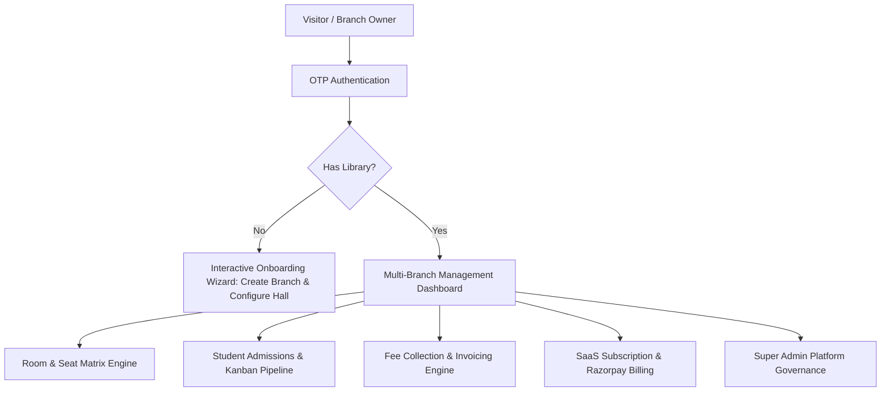
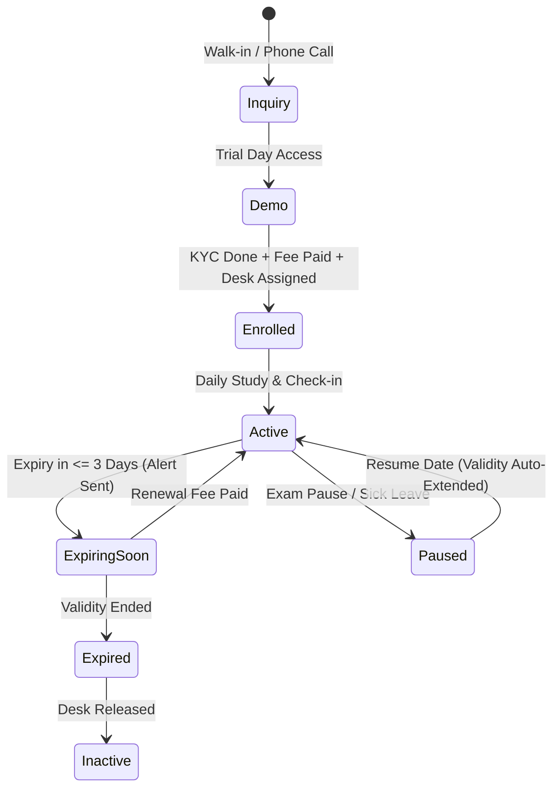

# seeLibrary — Application Workflow & Business Logic Specification

---

## 1. Executive Summary & System Overview

**seeLibrary** is an enterprise multi-tenant SaaS platform engineered specifically for study centers, competitive exam reading rooms, and modern co-working study libraries. The platform digitizes desk inventories, multi-shift seating allocations, student admissions, recurring fee collections, push notifications, and multi-branch operations.



---

## 2. User Roles, Access Hierarchy & Authorization Logic

The system enforces a multi-tiered role model distinguishing global platform governance from branch-level operations:

```
                      [ Super Admin ]
                 (Global Platform Governance)
                             │
                             ▼
                    [ Library Owner ]
                 (Branch Creation & Billing)
                             │
            ┌────────────────┴────────────────┐
            ▼                                 ▼
    [ Library Admin ]                 [ Library Staff ]
(Daily Ops, Admissions, Fees)   (Attendance, Inquiries, Shifts)
```

### 2.1 Role Definitions & Permissions
1. **Super Admin (`SUPER_ADMIN`)**:
   - Platform-wide sovereignty across all tenants and branches.
   - Controls SaaS subscription plans, global pricing, discounts, and coupon issuance.
   - Monitors platform metrics (Gross Merchandise Value, Active Desks, Total Admissions).
   - Manages library verification, suspensions, user privilege elevations, and system-wide broadcast notifications.
2. **Library Owner (`OWNER`)**:
   - Owns the legal entity and billing subscription of one or more library branches.
   - Has full access to add/remove study rooms, rows, seats, and staff members.
   - Can purchase, upgrade, renew, or cancel SaaS subscription plans.
3. **Library Admin / Manager (`ADMIN` / `MANAGER`)**:
   - Manages day-to-day student admissions, seat assignments, fee collections, and transaction receipts.
   - Has full operational access to branch data without access to billing cards or owner subscription settings.
4. **Staff (`STAFF`)**:
   - Handles student lookups, check-ins, locker assignment status, and inquiry logging.

---

## 3. Library Branch Onboarding & Management Workflow

### 3.1 Initial Setup Journey
When a new user signs up via OTP:
1. **Zero-State Detection**: If the user has zero associated branches, the platform presents an onboarding wizard rather than an empty dashboard.
2. **Step 1: Branch Metadata**:
   - Branch Name, Location/Address, City, State, Pincode, and Contact Details.
   - Generation of a clean URL slug (e.g., `elite-study-hub-rewa`).
3. **Step 2: Room & Hall Layout Definition**:
   - Definition of physical spaces (e.g., "Main Hall", "AC Quiet Zone", "First Floor").
   - Assignment of row naming schemas (Alphabetic: A, B, C or Numeric: 1, 2, 3).
4. **Step 3: Rapid Batch Generation of Desks**:
   - Automatic generation of desk inventories with sequential numbering (e.g., 01 to 60) and optional book locker attachments.

### 3.2 Multi-Branch Operations
- An owner can switch between multiple branches via a persistent Branch Switcher dropdown.
- All dashboard metrics (Occupancy, Revenue, Dues, Expiring Memberships) dynamically re-scope to the active branch.
- Cloud data synchronizes optimistically with instant local state updates and background database persistence.

---

## 4. Physical Space Hierarchy & Seat Inventory Architecture

The library physical infrastructure follows a strict parent-child relational hierarchy:

```
[ Library Branch ]
       └── [ Rooms / Zones ] (e.g., Silent Zone, AC Hall, Ground Floor)
                 └── [ Rows ] (e.g., Row A, Row 1, Premium Row)
                           └── [ Seats / Desks ] (e.g., Seat 01, 02... with optional 🔐 Locker)
```

### 4.1 Room Management
- Each branch contains one or more independent rooms.
- Each room maintains its own distinct row list, floor number, and active desk count.

### 4.2 Row & Seat Disambiguation Logic
- **Room Isolation**: Rows in different rooms with identical names (e.g., "Row 1" in Room A and "Row 1" in Room B) remain strictly isolated and never merge.
- **"All Rooms" Overview Mode**: Displays rooms as distinct sections with separate headers, row blocks, and desk matrices.
- **"Specific Room" Filter Mode**: Focuses purely on the selected room's grid.
- **Batch Seat Expansion**: Desk additions target the exact `(roomId, rowName)` combination with auto-suggested starting numbers to prevent numbering clashes.

---

## 5. Multi-Shift Seating Engine & Capacity Optimization

To maximize seat revenue per square foot, the seating matrix features a multi-shift allocation model:

```
┌────────────────────────────────────────────────────────────────────────┐
│                        SEAT OCCUPANCY SCHEMAS                          │
├────────────────────────────────────────────────────────────────────────┤
│ 1. FULL DAY (24/7 Exclusive)                                           │
│    [████████████████████████████████████████████████████████████████] │
│    • Exclusively locks the desk for 1 student.                         │
│    • Blocks Morning and Evening allocations.                           │
├────────────────────────────────────────────────────────────────────────┤
│ 2. SHARED TIME-SHARE (2 Slots / 2 Students Max)                        │
│    Slot 1: Morning Shift (06:00 AM – 02:00 PM)                         │
│    [████████████████████████░░░░░░░░░░░░░░░░░░░░░░░░░░░░░░░░░░░░░]     │
│    Slot 2: Evening Shift (02:00 PM – 10:00 PM)                         │
│    [░░░░░░░░░░░░░░░░░░░░░░░░████████████████████████░░░░░░░░░░░░]     │
│    • Allows 2 independent students to share 1 physical desk.          │
│    • Doubles the revenue yield per desk.                               │
└────────────────────────────────────────────────────────────────────────┘
```

### 5.1 Shift Types
1. **Full Day (`FULL_DAY`)**: 24-hour unlimited access.
2. **Morning Shift (`MORNING` / `HALF_DAY` / `FOUR_HOURS`)**: First-half study slot.
3. **Evening Shift (`EVENING`)**: Second-half study slot.
4. **Night Shift (`NIGHT`)**: Overnight study slot.

### 5.2 Seat Allocation Rules & Conflict Resolution
- **Rule 1 (Full Day Exclusivity)**: When a desk is assigned to a `FULL_DAY` student, no other student can be assigned to that desk.
- **Rule 2 (Shift Sharing)**: If a desk has an assigned `MORNING` student, it remains available for an `EVENING` student, and vice versa.
- **Rule 3 (Conflict Eviction)**: If a manager assigns a new `FULL_DAY` student to an already-shared desk, the existing shift occupants are unassigned from that desk (moved to unassigned status) to prevent physical double-booking.
- **Rule 4 (Status Flags)**:
  - `AVAILABLE`: 0/2 slots occupied (or completely free).
  - `OCCUPIED`: 1/1 (Full Day) or 2/2 (Morning + Evening) or 1/2 (Partial shift active).
  - `RESERVED`: Temporarily held for incoming student.
  - `MAINTENANCE`: Out of order (repairs, electrical work, broken chair).

---

## 6. Student Lifecycle & Admission Pipeline

The student journey spans inquiry, onboarding, desk allocation, and ongoing membership management:



### 6.1 Admission Workflow
1. **Registration Form**: Captures Student Name, Phone, Email, Father's Name, Study Purpose (e.g., UPSC, NEET, CA, Banking).
2. **KYC Verification**: Identity document selection (Aadhaar, Passport, Voter ID) with document number and photo upload to secure cloud storage.
3. **Desk & Shift Choice**: Selects target Room, Row, Desk Number, and Shift.
4. **Fee Initialization**: Sets Monthly Base Fee, initial collection amount, payment method (UPI, Cash, Card), and duration (1, 3, 6, 12 months).

### 6.2 Admission Kanban Pipeline
The pipeline visualizes leads and admissions across 4 distinct stages:
- **Inquiry**: Prospective students seeking library tour or fee structure.
- **Demo / Trial**: Students taking a 1–2 day trial study shift.
- **Active Enrolled**: Paid members with active memberships and desks.
- **Inactive / Past**: Students who vacated seats or whose memberships ended.

---

## 7. Fee Collection, Receipts & Invoicing Engine

The financial engine tracks fees, payment modes, partial installments, and tax receipts:

```
[ Fee Collection Flow ]
        │
        ├── Full Payment ──────► [ Mark PAID ] ──────► [ Extend Validity ] ──► [ Generate Receipt ]
        │                                                                             │
        └── Partial Payment ───► [ Mark PARTIAL ] ───► [ Record Remaining Due ]       ▼
                                                                             [ WhatsApp Share & PDF ]
```

### 7.1 Payment Processing Logic
- **Full Settlement**: If paid amount equals or exceeds the monthly fee, the transaction status is `PAID` and `remainingFee` is `0`.
- **Partial Installment**: If paid amount is less than total fee, status is `PARTIAL`, recording `remainingFee = totalFee - paidAmount`.
- **Due Settlement**: Future collections against this student automatically reduce and settle outstanding partial dues.
- **Validity Extension**: When fee is collected for a month or period, the student's `validTo` date and `membershipEndsInDays` automatically calculate and extend based on the duration purchased.

### 7.2 Digital Receipt & Invoicing
- Generates a receipt identifier (e.g., `REC-123456-7890`).
- Provides a printable, responsive receipt modal containing:
  - Library Name, Address, and Contact.
  - Student Details, Seat Number, and Shift.
  - Payment Mode (UPI, Cash, NetBanking, Card), Validity Period, and Due balances.
- **One-Click WhatsApp Sharing**: Formats an instant payment confirmation message pre-filled with receipt breakdown and validity dates.

---

## 8. SaaS Subscription & Monetization Engine

Platform monetization operates via tiered SaaS subscriptions:

### 8.1 Plan Tiers
- **Starter / Solo Branch**: Up to 50 seats, 1 branch.
- **Pro / Growing Center**: Up to 200 seats, up to 3 branches, locker tracking, SMS/WhatsApp integration.
- **Enterprise / Multi-Branch Chain**: Unlimited seats, unlimited branches, custom domain, priority push server.

### 8.2 Subscription Lifecycle & Feature Gating
- **Trial (`TRIAL`)**: 14-day full access upon initial sign-up.
- **Active (`ACTIVE`)**: Paid subscription with auto-renewal or manual billing.
- **Past Due / Expired (`EXPIRED` / `PAST_DUE`)**: Enters a grace period. Core data remains readable, but destructive edits or new student admissions prompt the `SubscriptionRequiredModal`.
- **Coupons & Promotional Discounts**: Validates coupon codes against minimum order values, expiration dates, and per-user redemption limits before computing net checkout totals.
- **Razorpay Integration**: Creates server-side orders, verifies HMAC-SHA256 payment signatures, and reconciles webhooks to guard against missed browser redirects.

---

## 9. Automated Alerts, Push Notifications & Expiry Monitoring

To prevent revenue leakages and empty desks:

1. **Expiry Sentinel Engine**: Runs periodic cron checks comparing `membership.expectedEndDate` against current timestamps.
2. **Push Notifications (Web Push / VAPID)**:
   - **T-3 Days Warning**: Notifies student and library admin that validity expires in 72 hours.
   - **T-0 Expiry Notice**: Notifies admin that membership has expired so desk can be renewed or allocated to waitlisted students.
   - **Broadcast Notifications**: Super Admins can dispatch system-wide platform advisories directly to all branch owners.

---

## 10. Data Synchronization & Offline Resilience

- **Optimistic UI Engine**: All dashboard updates (seat changes, shift toggles, fee payments) render in real-time on the client immediately.
- **Database Synchronization**: API calls commit updates to PostgreSQL via Prisma ORM.
- **Local Fallback Cache**: In low-connectivity environments, active branch IDs, theme preferences, and essential cached records persist in `localStorage` to ensure zero screen freezes.
